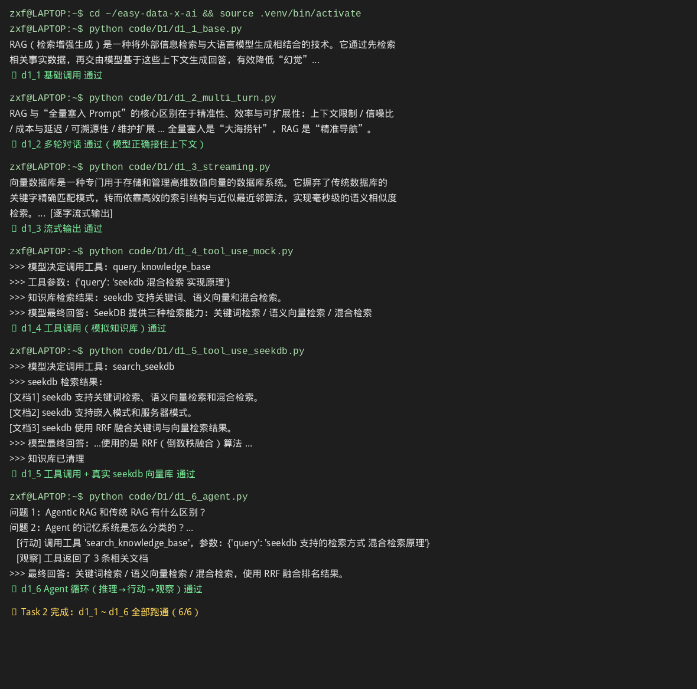

# Task 2：场景识别 + RAG 产品设计 + AI 原生数据系统

> ⏰ 截止时间：2026-09-20 03:00
> 📖 产品篇 P1《AI Agent 场景识别》+ 开发者篇 D1《大模型 API 工程化基础》+ 产业应用篇 I1《AI 原生数据库基础》

## 01 实践成果

### 环境与 Key

| 项目 | 结果 |
|:--|:--|
| 测试 API Key | ✅ 阿里云 DashScope（OpenAI 兼容端点） |
| 模型 | `qwen3.7-flash-2026-07-15`（用完后切 `qwen3.7-flash`） |
| pyseekdb SDK | ✅ 已安装（v1.4.0.post1） |
| code/D1 示例 | ✅ **d1_1 ~ d1_6 全部跑通（6/6）** |

**实测截图：**



### 六个示例跑通记录

| 示例 | 体验内容 | 结果 |
|:--|:--|:--|
| `d1_1_base.py` | 最基础的一次大模型调用 | ✅ |
| `d1_2_multi_turn.py` | 多轮对话，模型接住上下文 | ✅ |
| `d1_3_streaming.py` | 流式输出，逐字返回 | ✅ |
| `d1_4_tool_use_mock.py` | 工具调用（模拟知识库） | ✅ |
| `d1_5_tool_use_seekdb.py` | 工具调用 + **真实 seekdb 向量库** | ✅ |
| `d1_6_agent.py` | **Agent 循环**：推理→行动→观察 | ✅ |

**运行方式（复现）：**
```bash
cd ~/easy-data-x-ai && source .venv/bin/activate
python code/D1/d1_1_base.py          # 依次跑到 d1_6_agent.py
```

## 02 学习心得（张博本人理解）

<!-- 待张博补充：跑完这 6 个示例后最大的感受 -->

从 Task 1 的"一次提问、一次回答"，到 d1_6 的"推理 → 行动 → 观察"循环——这条演进路径正好印证了 Task 1 的那句话：**Agent 能力 = 模型能力 × 数据质量 + 流程编排**。模型是同一个模型（qwen3.7-flash），变化的是**流程编排**（是否绑工具、是否多轮循环）和**数据**（模拟知识库 → 真实 seekdb 向量库）。

## 📖 引用来源

- 课程仓库：https://github.com/datawhalechina/easy-data-x-ai
- 开发者篇 D1：`docs/dev/D1 课程稿：大模型 API 工程化基础.md`
