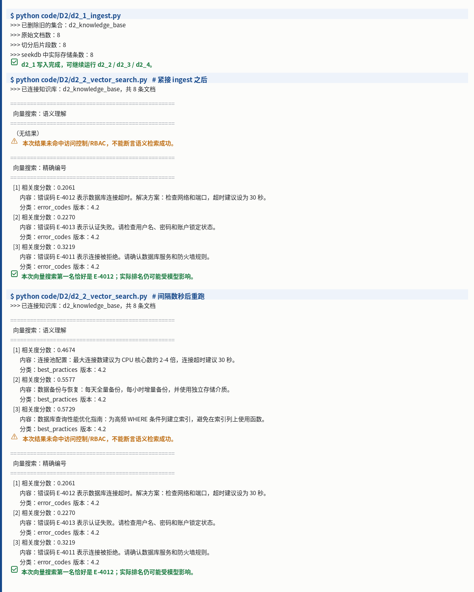

# Task 3：RAG 产品设计 + RAG 与向量数据库

> ⏰ 截止时间：2026-09-23 03:00
> 📖 产品篇 P2《让 Agent 会查资料 —— RAG 产品设计》+ 产业应用篇 I2《向量数据库与 RAG》

## 01 实践成果

### 代码跑通

Task 3 要求跑通 `code/D2` 的 **d2_1 ~ d2_2**（注意：`d2_3 ~ d2_5` 属于 Task 4，本次不跑）。

| 脚本 | 做什么 | 结果 |
|:--|:--|:--|
| `d2_1_ingest.py` | 建知识库：8 条原始文档 → 切分 → 写入 seekdb | ✅ 原始 8 → 切分 8 → 存储 8 |
| `d2_2_vector_search.py` | 向量搜索：① 语义理解查询 ② 精确编号查询 | ✅ 两条查询均返回结果 |

**实测截图（真实终端原始输出）：**



> 该图为脚本 stdout 的**逐行原样渲染**，未做概括或美化。

### 真实输出摘录

**d2_1 写入完成**
```
$ python code/D2/d2_1_ingest.py
>>> 已删除旧的集合：d2_knowledge_base
>>> 原始文档数：8
>>> 切分后片段数：8
>>> seekdb 中实际存储条数：8
✅ d2_1 写入完成，可继续运行 d2_2 / d2_3 / d2_4。
```

**d2_2 语义搜索（间隔数秒后重跑）+ 精确编号搜索**
```
$ python code/D2/d2_2_vector_search.py
>>> 已连接知识库：d2_knowledge_base，共 8 条文档

==================================================
  向量搜索：语义理解
==================================================
  [1] 相关度分数：0.4674
       内容：连接池配置：最大连接数建议为 CPU 核心数的 2-4 倍，连接超时建议 30 秒。
       分类：best_practices  版本：4.2
  ...
==================================================
  向量搜索：精确编号
==================================================
  [1] 相关度分数：0.2061
       内容：错误码 E-4012 表示数据库连接超时。解决方案：检查网络和端口，超时建议设为 30 秒。
✅ 本次向量搜索第一名恰好是 E-4012；实际排名仍可能受模型影响。
```

---

## 02 一个真实的坑：写入成功 ≠ 立刻可检索

### 现象

`d2_1` 写入完成后**立即**运行 `d2_2`，第一条**语义查询**返回「（无结果）」；**隔约 5 秒再跑就正常返回 3 条**。复现稳定，每次一致。

```
# 紧接 ingest 之后
  向量搜索：语义理解
  （无结果）                      ← 索引尚未就绪
⚠️  本次结果未命中访问控制/RBAC，不能断言语义检索成功。

# 间隔数秒后重跑
  向量搜索：语义理解
  [1] 相关度分数：0.4674  ...      ← 正常返回 3 条
```

### 我的判断

`collection.add()` 返回「写入完成」，指的是**数据已落库**；但向量检索依赖的 **ANN 索引是异步构建的**。索引没建好时查询命中 0 条，**不代表数据不在、也不代表检索质量差**。

值得注意的是：**精确编号搜索（E-4012）在两次运行中都正常返回**。这进一步说明问题不在数据本身，而在语义（ANN）索引的**时序**上。

### 对我的三点启发

1. **写入 API 的返回值语义要看清** —— 「add 成功」≠「可被检索」。生产链路里，写入后立刻查询是需要显式处理的时序问题。
2. **脚本里的告警要看懂再信** —— `⚠️ 不能断言语义检索成功` 这次属于**假警报**，是索引时序导致的，不是检索效果不行。看到告警先问「是数据问题还是时序问题」。
3. **这跟 Task 2 的认知是一条线** —— Task 2 我写下「模型负责想，数据库负责记住」；这次补上后半句：**数据库"记住"本身也分阶段**，落库和可检索不是同一时刻。

---

## 03 理解：混合搜索为什么不是"高级玩法"

P2 和 I2 都反复强调同一件事：**只要你做生产级 RAG，混合搜索就是基础能力，跟是不是 Agentic 无关。**

### 真实问题天然是"混合"的

课程举的例子，一个提问里同时叠了四类需求：

> seekdb 1.2.0 在金融客户环境里的兼容性要求是什么？如果已经部署 1.0.0，升级前要注意什么？

| 需求类型 | 靠什么解决 | 单靠向量检索会怎样 |
|:--|:--|:--|
| **语义理解**（用户不会用文档原话） | 向量检索 | ✅ 能解决 |
| **精确匹配**（`1.2.0` / `1.0.0` 这类版本号） | 全文检索 | ❌ 容易漂 |
| **范围过滤**（行业、版本、发布时间） | 标量过滤 | ❌ 做不到 |
| **多跳整合**（先找 A 再找 B 再合并） | Agent 编排 | ❌ 单轮检索不可能 |

**结论：只用单次向量检索，四类里只能解决一类。**

### 三类检索分工

| 检索方式 | 解决什么 |
|:--|:--|
| **向量检索** | "怎么表达都能找到" —— 语义近似 |
| **全文检索** | "专有名词和精确信息必须找准" —— 错误码、型号、订单号 |
| **标量过滤** | "只在正确范围内找" —— 权限、租户、状态、时间 |

### 两路结果怎么合并：RRF

向量分数（距离）和关键词分数（BM25）**量纲不同，不能直接相加**。RRF（Reciprocal Rank Fusion）的做法是**不比分数，比名次**：

$$\operatorname{RRF}(d)=\sum_{r\in R}\frac{1}{k+r(d)}$$

其中 $r(d)$ 是文档 $d$ 在某路召回里的**排名**，$k$ 是平滑常数。这样就不需要假设两个分数可比。

> ⚠️ 如果非要用加权分数融合，得先**校准或归一化**各路分数，权重还要靠验证集定 —— 比 RRF 麻烦得多。

### 一个安全细节（I2）

"先取向量 Top-10，再过滤权限"这个写法**很危险**：
- 过滤后可能**不足 10 条**
- 更要命的是 —— **无权限数据可能进入中间处理或日志**

**安全边界应尽可能在检索阶段生效**，而不是检索完再裁剪。

---

## 04 归因：AI 答错了，先别怪模型

P2 给了「三层归因框架」，核心判断是：**大多数问题在数据层，不在模型层。**

对应到我自己要落地的医疗器械场景（研发知识库、注册资料、周报），这个框架尤其有用：

- 问"AI 答错了"，先分：是**没检索到**（数据/检索层）、还是**检索到了但答歪**（生成层）、还是**需求本身就模糊**（业务层）
- 排查顺序应该从下往上，而不是第一反应「换个更好的模型」

---

## 05 学习心得

> 原话（张博）：RAG 不单单是指向量化加语义检索；做一个 RAG 其实需要很多步骤；其中最重要的还是我们对自己业务场景中的数据的准备和认知。

### 一、RAG 不等于「向量 + 语义检索」

这是我这次最大的认知修正。

以前听到 RAG，脑子里就是「把文档切了、转成向量、存库、搜最像的几条、丢给模型」。P2 一开头就把这个拆了：**RAG 的重点在第一个词 —— Retrieval（检索），不在 Vector。**

检索是一整个工具箱：全文检索（错误码、版本号、产品型号）、向量检索（口语化提问、同义表达）、标量过滤（权限、租户、时间、产品线）、图谱跳转、API 调用……**向量只是其中一路。**

课程里那个例子对我触动最大：用户搜「seekdb 1.2.0 的兼容性」，只有纯向量检索的系统，把 1.0.0 的文档捞了出来 —— 在向量空间里这俩「很像」，但用户要的是 1.2.0。**向量懂「意思像」，但不懂「精确」。**

所以只用一路检索，出问题几乎是必然的。这也是混合搜索为什么不是「高级玩法」的原因。

### 二、一个能上线的 RAG，是条六步链路

以前我以为 RAG 就是「检索 + 生成」四个字。实际它是一条完整链路：

**数据准备 → 改写 & 路由 → 搜索召回 → 融合 & 重排 → 上下文组织与生成 → 评估与反馈闭环**

前三步决定能不能**找对**，后三步决定能不能**答对**。课程说得很直白：这条链路里任何一环做差了，最后都会表现成同一句话 —— 「AI 没能解决我的问题」。

这也解释了为什么「换个更好的模型」经常没用：你治的不是真正的病。

### 三、最重的活是数据准备，而数据准备的前提是懂自己的业务

六步里，被课程标为「最容易被低估、但最影响最终效果」的，是第一步 —— **数据准备**。

它不是「把文档丢进向量库」，而是要逐条回答：怎么加载、怎么解析、怎么清洗、怎么切分、怎么补元数据、怎么建索引、怎么更新。

我的落点很直接：**这一步没法外包给技术，因为只有业务方知道哪些数据是对的、哪些已经过期、哪些字段必须能精确匹配。**

P2 的三层归因框架把这件事说透了：把「AI 答得不好」拆成数据层 / 模型层 / 业务层，课程给的实测比例是 —— **60% ~ 80% 的问题在数据层，真正的模型幻觉只占 10% ~ 20%。**

而最常见的错误反应是「换个更好的模型」。这就是误诊：把数据层的病，当成模型层的病在治。

对我自己更有意义的一点：我手上的医疗器械研发场景（仿真数据、测试报告、注册资料），恰恰是「数据准备」最难、也最值钱的地方 —— 文档有版本号、有注册证编号、有生效日期、有权限范围，这些**必须精确匹配**，光靠语义像不行。

**一句话收尾：** 一个 RAG 的上限，不取决于你用了多强的模型，而取决于你能不能把正确的信息找回来 —— 而能不能找回来，首先取决于你对自己的数据有多清楚。

---

## 06 待完成

- [x] `code/D2` d2_1 ~ d2_2 跑通
- [x] 学习心得（见上节 05）
- [ ] GitHub 打卡提交（张博本人填写）

---

*记录：2026-09-21 ｜ 实验环境：WSL + Python 3.12.3 venv ｜ 模型：DashScope qwen3.7-flash*
