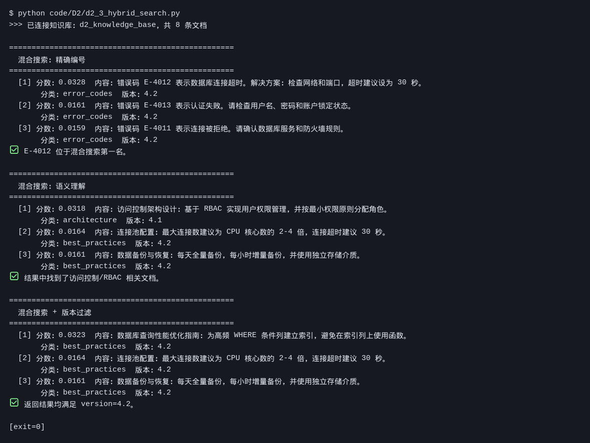

# Task 4：AI Native 数据层与 AI Functions

> ⏰ 截止时间：2026-09-26 03:00
> 📖 开发者篇 D2《统一 AI Native 数据层实战》+ 产业应用篇 I3《SQL × AI 与 AI Functions》

## 01 实践成果

### 代码跑通

Task 4 要求跑通 `code/D2` 的 **d2_1 ~ d2_5**（d2_1 / d2_2 在 Task 3 已跑过，本次补齐 d2_3 ~ d2_5，并一并复跑留证）。

| 脚本 | 做什么 | 结果 |
|:--|:--|:--|
| `d2_1_ingest.py` | 建知识库：8 条原始文档 → 切分 → 写入 seekdb | ✅ 原始 8 → 切分 8 → 存储 8 |
| `d2_2_vector_search.py` | 纯向量搜索：语义查询 + 精确编号查询 | ✅ 两种查询均返回结果 |
| `d2_3_hybrid_search.py` | 混合搜索：向量 + 全文，含版本过滤 | ✅ 三组查询全部命中 |
| `d2_4_compare.py` | 纯向量 vs 混合搜索，三组查询对照 | ✅ 混合搜索稳定胜出 |
| `d2_5_chunking_compare.py` | 分块策略对比：固定 / 动态 / 父子 | ✅ 三策略 Recall@3 出数 |

**实测截图（真实终端原始输出）：**



> 该图为脚本 stdout 的**逐行原样渲染**，未做概括或美化。

### 真实输出摘录

**d2_3 混合搜索（三组查询）**

```
$ python code/D2/d2_3_hybrid_search.py
>>> 已连接知识库：d2_knowledge_base，共 8 条文档

==================================================
  混合搜索：精确编号
==================================================
  [1] 分数：0.0328  内容：错误码 E-4012 表示数据库连接超时。解决方案：检查网络和端口，超时建议设为 30 秒。
       分类：error_codes  版本：4.2
✅ E-4012 位于混合搜索第一名。

==================================================
  混合搜索：语义理解
==================================================
  [1] 分数：0.0318  内容：访问控制架构设计：基于 RBAC 实现用户权限管理，并按最小权限原则分配角色。
✅ 结果中找到了访问控制/RBAC 相关文档。

==================================================
  混合搜索 + 版本过滤
==================================================
✅ 返回结果均满足 version=4.2。
```

**d2_5 分块策略对比**

```
  策略                   块数       均长   Recall@3
  --------------------------------------------
  固定 overlap            5     186字       60%
  动态 overlap            6     185字      100%
  父子 chunk              9     104字       60%
```

---

## 02 对照实验：混合搜索到底补了什么

`d2_4_compare.py` 用同一组查询分别走「纯向量」和「混合（向量 + 全文）」，差异很直观：

| 查询 | 纯向量第一名 | 混合搜索第一名 |
|:--|:--|:--|
| 错误码 E-4012 的解决方案 | 恰好是 E-4012 | E-4012，分数更集中 |
| 怎么设计用户权限 | **连接池配置**（跑偏） | **访问控制架构 RBAC** ✅ |
| 数据库性能优化 | 连接池配置 | **数据库查询性能优化指南** ✅ |

两处跑偏都发生在「纯语义」这条路：查询词和文档用词不完全重合时，向量检索会被「数据库」这个大类语义带走，抓回一堆同主题但不对题的文档。混合搜索加入全文这一路后，精确词面命中把正确文档顶了上来。

我之前的理解是「混合搜索 = 更准」，跑完这一轮更想说：**它补的不是精度，是另一条判断路径**。向量靠语义相近，全文靠字面重合，两者分数体系不同（所以才有 RRF 比排名而不是比分数），互为兜底。单靠一路，遇到它盲区里的查询就会整条跑偏。

---

## 03 一个复现的坑：写入成功 ≠ 立刻可检索

这次复跑 `d2_2` 又撞上了 Task 3 记录过的那个现象：

- `d2_1` 写入后**立即**跑 `d2_2` → 第一条语义查询返回「（无结果）」；
- **隔 5 秒重跑** → 三条结果正常返回。

两次实验现象一致，判断不变：`collection.add()` 返回时 **ANN 向量索引尚未建好**（异步构建），此刻查询命中 0。脚本那句「⚠️ 不能断言语义检索成功」属于**假警报**，不是检索质量问题。

有意思的是它和 d2_3 的对比：**同时点下** `d2_3` 混合搜索却能正常出结果。合理推测是混合搜索那一路（全文检索）不依赖向量索引，先建好了，所以先有返回；等另一条路追上，混合结果才完整。

---

## 04 这次的体会

- **数据层是「多副面孔」的同一份数据。** 同一条记录，既要有精确编号查询、又要有语义查询、还要有全文与版本过滤——不是选一种，是要能同时被这几种方式查到。这才是「AI Native 数据层」的意思。
- **调模型的顺序有讲究：先过滤、再召回、最后才调模型。** 版本过滤在检索阶段就把范围收窄，模型只处理已经过筛的内容，省的是又慢又贵的调用。
- **分块策略与检索后端是两件事。** `d2_5` 开头那句提示很关键：块怎么切，和用什么引擎去查，是两个独立变量。动态 overlap 在这组实验里 Recall@3 到 100%，但它胜在边界处理，不是「更聪明的检索」。
- **一个诚实记录：** 语义分块这一路这次没跑成——需要 `BAAI/bge-m3` 的 embedding，当前 API Key 无该模型权限，脚本已自动降级为内存检索并跳过语义分块。表里三行结果不含语义分块，属于已知缺失，不作推断。

---

## 05 心得（2026-09-25）

这次跑 D2，最没想到的是「混合搜索」这四个字我上次理解偏了。

上次跑 d2_2，两条查询分开跑，各自都对得上，我就把混合搜索当成「两种搜索合在一起，结果更准」。这次 d2_4 把同一组查询分别走两条路，才看出不一样的东西：「怎么设计用户权限」和「数据库性能优化」两问，纯向量搜索都跑偏了，都倒回「连接池配置」那条。

我想了想为什么会这样。查询里带着「数据库」这个大词，向量空间里它是个很强的簇，于是同主题但不对题的文档就一起被捞上来了。说白了，向量检索认的是「像不像」，不是「对不对」。而全文那一路比的是字面重合，「权限」两个字没出现在连接池那篇里，自然顶不上来。

所以混合搜索补的好像不是精度，是另——一条判断路径。向量靠语义相近，全文靠字面重合，两套尺子量出的数根本不可比（所以才要比名次，不比分数），互为兜底。单靠一路，撞到它的盲区就整条跑偏。这比我上次那句「更准」具体多了。

另外 d2_5 把「切」和「查」拆成了两件事。三种分块策略跑出来：固定 overlap 60%、动态 overlap 100%、父子 chunk 60%。数字很好看，但我看到的是脚本开头那句提示：分块策略与检索后端是两个独立变量。动态 overlap 胜在边界处理，不是「更聪明的检索」——把这两个混着调，以后出了问题永远说不清是哪个的责。

也有个诚实的地方得记下来：语义分块这次根本没跑成，它要单独的 embedding 服务，我这个 Key 没权限。所以上面三行里没有它，不能拿这三个数去说它不好。

最后是那个又碰到了的坑：d2_1 写完立即跑 d2_2，语义查询返回「（无结果）」，隔几秒重跑就正常。但同一时刻 d2_3 混合搜索却正常。我猜是向量索引异步构建（ANN 结构比较慢），全文那一路先建好了，所以先有返回。这只是我的推测，不是课程结论，但它提醒我一件事：异步系统里，「写入成功」不等于「可检索」。

把这几件事连起来看，还是回到我 Task 1 写的那句：Agent 能力 = 模型能力 × 数据质量 + 流程编排。上次第 3 课讲的是编排里怎么合，这次 D2 讲的是数据里怎么存——同一条记录，精确、语义、关键词、属性四种面孔得一起带上，缺一个，某类查询就整条失效。

---

*创建：2026-09-25*
