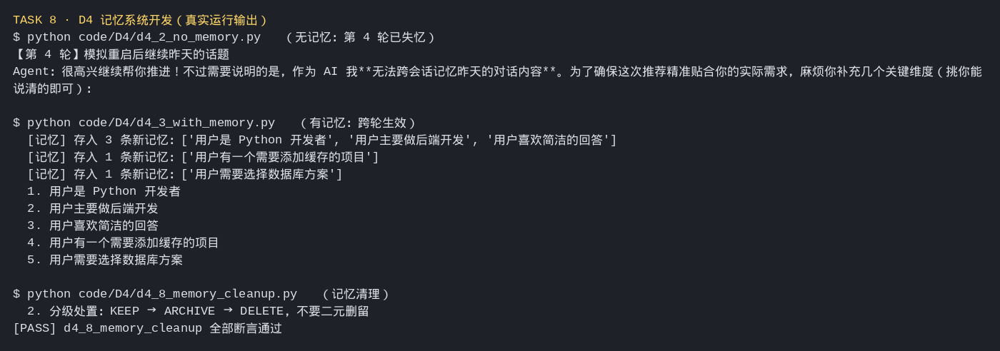

# Task 8：Agent 记忆系统开发

> ⏰ 截止时间：2026-10-08 03:00
> 📖 术篇 D4《记哪些、忘哪些》+ 产业应用篇 I7《PowerContext 的设计与实现》

## 01 实践成果

### 材料情况

- **D4**（术篇）：完整课程稿 + 8 个可运行示例（`code/D4/d4_1 ~ d4_8`），主题是"把记忆系统的各个环节拆开，各自演示"。
- **I7**（产业篇）：课程页标注**「正在开发中」**，只有方向与共建边界说明（Source / Memory / PreparedContext / Handoff 的数据关系、不可变修订与证据引用、接口边界、检索契约），**无配套脚本**。动手项以 D4 八个示例 + 对 PowerContext 项目设计的理解为主。

### 示例代码跑通

| 目录 | 做什么 | 结果 |
|:--|:--|:--|
| `code/D4/d4_1_react_loop.py` | ReAct 推理循环：Agent 自主决定调哪个工具、调几次 | ✅ 多步推理跑通，max_steps 安全阀生效 |
| `code/D4/d4_2_no_memory.py` | 无记忆基线：每轮对话都是全新的 | ✅ 四轮对照，重启即失忆 |
| `code/D4/d4_3_with_memory.py` | 有记忆版本：Agent 记住用户身份与偏好 | ✅ 5 条记忆跨轮生效 |
| `code/D4/d4_4_memory_agent.py` | 完整记忆 Agent（交互式，跨进程持久化） | ✅ 落盘记忆库 + 交互指令 |
| `code/D4/d4_5_multi_user_isolation.py` | 多用户记忆隔离（user_id 命名空间） | ✅ 全部断言通过 |
| `code/D4/d4_6_memory_compression.py` | 记忆压缩（画像 + 事实库分层） | ✅ `[PASS]` 全部断言通过 |
| `code/D4/d4_7_hot_cold_tier.py` | 冷热分层（冷数据移出热索引） | ✅ `[PASS]` 全部断言通过 |
| `code/D4/d4_8_memory_cleanup.py` | 记忆清理（KEEP → ARCHIVE → DELETE 分级） | ✅ `[PASS]` 全部断言通过 |

### 真实输出摘录



**d4_2（无记忆）vs d4_3（有记忆）对照**

```
【d4_2 · 第 1 轮】
用户：我是一个 Python 开发者，主要做后端开发，喜欢简洁的回答。
Agent：明白。后续我会保持直接、无废话……（但下一轮就忘了）

【d4_2 · 第 4 轮】
用户：继续昨天的话题，帮我选一个数据库方案。
Agent：……作为 AI 我无法跨会话记忆昨天的对话内容。
```

```
【d4_3 · 第 1 轮】
  [记忆] 存入 3 条新记忆：['用户是 Python 开发者', '用户主要做后端开发', '用户喜欢简洁的回答']
【d4_3 · 第 2 轮】
  推荐更贴合"Python 后端 + 喜欢简洁"的口径
【d4_3 · 记忆库】共 5 条：
  1. 用户是 Python 开发者
  2. 用户主要做后端开发
  3. 用户喜欢简洁的回答
  4. 用户有一个需要添加缓存的项目
  5. 用户需要选择数据库方案
```

**d4_5 ~ d4_8 的收尾结论（脚本自打印）**

```
d4_5 多用户隔离：
  1. 多用户记忆必须用 user_id 做命名空间，检索时一并过滤
  2. 过滤应发生在查询构建阶段，而不是检索后再丢弃
  3. 删改要做所有权 / 授权校验，越权必须显式失败
  4. 跨用户可见只能走显式分享，且按最小权限放行

d4_6 压缩：多条变一条换压缩比，画像承载稳定约束，事实库承载长尾细节
d4_7 分层：冷数据必须移出热索引，不能只靠排序沉底
d4_8 清理：分级处置 KEEP → ARCHIVE → DELETE；硬删必须级联主库/向量/缓存
```

### 环境坑（课程正文未载）

D4 的 4 个示例脚本里 `MODEL` 写死成 `deepseek-ai/DeepSeek-V3`，当前 API Key 没有该模型权限，直接报：

```
openai.NotFoundError: Error code: 404 - The model `deepseek-ai/DeepSeek-V3`
does not exist or you do not have access to it.
```

**处理：** 按本课程本地环境的一贯做法，把 `d4_1 ~ d4_4` 的模型名统一改成 `qwen3.7-flash-2026-07-15`（走 DashScope 兼容端点），四个脚本随即全部跑通。这是**环境适配**，不是代码逻辑问题。

---

## 02 这次的体会

**1. "有没有记忆"的差距，本质是"用户要不要每次重新自我介绍"。**

D4 里 d4_2 和 d4_3 的对照最能说明问题。同样是四轮对话，无记忆版到第四轮就直接说"我无法跨会话记忆昨天聊的"，用户被迫把身份、技术栈、偏好再讲一遍；有记忆版记得住"Python 后端 + 喜欢简洁"，推荐就直接落到点上。这跟 P3 讲的记忆系统不是一个抽象概念，是有体感的差别。

**2. 记忆系统真正的工程量，全在"记住之后"：隔离、压缩、分层、清理。**

d4_1~d4_3 把"存进去、拿出来"演示完，看起来已经成了。但 d4_5~d4_8 才是重头：多用户必须用 `user_id` 做命名空间、检索在构建阶段就过滤（不是查完再丢）、压缩要"多条变一条"而不是把字压扁、冷数据要真的移出热索引、清理要分 KEEP/ARCHIVE/DELETE 三级并且硬删级联主库向量缓存。这跟 P3 那句"难的不是记住，是忘掉"完全对上——**存是顺手就完成的事，管才是要设计的事。**

**3. 一个很实在的细节：隔离要发生在"查询构建阶段"，不是"检索之后再过滤"。**

d4_5 把这条单独拎出来强调，我印象很深。检索后再丢，等于先把别人的数据取出来再扔掉：既浪费又危险；在查询构建时就带上 `user_id` 过滤，才是正确的边界。这类"看起来等价、实则不等价"的实现选择，是记忆系统能不能上生产的分水岭。

**4. I7 想讲的，是把 D4 这套东西放到工业尺度上看。**

I7 虽然还在开发中，但它列的方向很清楚：Source / Memory / PreparedContext / Handoff 四者的数据关系、不可变修订与证据引用、生命周期管理、Server/Client/Core SDK/HTTP/MCP 的接口边界、以及全文/向量/混合检索的契约。D4 是"我从零搭一遍"，I7 是"工业实现怎么把这些拆成可替换的接口"——一个讲原理，一个讲边界。

**5. 最大的收获：这一课把"记忆"从玄学拽回了数据管理。**

前几课讲"数据质量决定 Agent 效果"时，我更多是理解成知识库/RAG 那一层。Task 8 之后我把记忆也归进去了：记忆就是一类**会不断写入、需要分层和清理、还要严格隔离**的数据。Agent 表现得"懂你"或"忘了你"，背后都是这套数据有没有被管好。这跟 Task 7 的结论是一回事——**能当数据管的，就该按数据管。**

---

*创建：2026-10-02*
