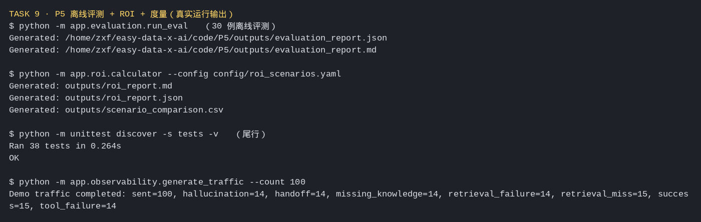

# Task 9：场景、总结与测评

> ⏰ 截止时间：2026-10-11 03:00
> 📖 道篇 P5《综合案例与度量》+ 术篇 D5《课程总结》+ 产业应用篇 I8《案例场景和测评构建》

## 01 实践成果

### 材料情况

- **P5**（道篇）：完整课程稿 + 配套工程代码（`code/P5`），从离线评测一路走到 Agent API、Prometheus Metrics、Grafana、ROI。
- **D5**（术篇）：课程总结篇，收束 D1~D4 的术篇主线。
- **I8**（产业篇）：课程页标注**「正在开发中」**，只有方向与共建边界说明（从业务目标拆任务/数据/约束/失败成本、检索与回答质量、确定性回放与离线重评分、记录输入输出与执行轨迹），**无配套脚本**。动手项以 P5 的离线评测 + ROI 为主。

### 示例代码跑通

| 命令 | 做什么 | 结果 |
|:--|:--|:--|
| `python -m app.evaluation.run_eval` | 离线评测 30 个样本，产出 JSON/Markdown 报告 | ✅ 生成 evaluation_report.md/json |
| `python -m app.roi.calculator` | 三种情景 ROI 批量对比 | ✅ 生成 roi_report.md/json + scenario_comparison.csv |
| `python -m unittest discover -s tests` | 全量单测 | ✅ **38 tests OK** |
| `uvicorn app.main:app` | 起离线 Knowledge Agent API | ✅ /health 返回 `{"status":"ok"}` |
| `python -m app.observability.generate_traffic --count 100` | 生成 100 条 demo 流量 | ✅ sent=100，各指标计数就位 |
| `/metrics` | Prometheus 指标导出 | ✅ `agent_requests_total{status="success"} 100` |

### 真实输出摘录



**离线评测报告（30 例，四层指标）**

```
【数据层】知识覆盖率 82.76% ｜ 检索命中率 95.83% ｜ 检索故障率 3.33%
【模型层】回答准确率 96.67% ｜ 幻觉率 3.33%
【业务层】任务成功率 73.33% ｜ 转人工率 23.33% ｜ 行为一致率 100.00%
【运行层】工具成功率 80.00% ｜ 平均延迟 108.67ms ｜ 平均 Token 23.53
```

**ROI 三情景对比（首年，CNY）**

```
情景          总成本       总收益       净收益       ROI       回收期   状态
conservative  14,900.00   11,256.00   -3,644.00   -24.46%   107.89   亏损
base          13,600.00   22,800.00    9,200.00    67.65%     3.64   盈利
optimistic    13,648.00   39,432.00   25,784.00   188.92%     1.61   盈利
```

**Demo 流量与指标**

```
Demo traffic completed: sent=100, hallucination=14, handoff=14,
missing_knowledge=14, retrieval_failure=14, retrieval_miss=15,
success=15, tool_failure=14

agent_requests_total{agent_version="mock-v1",environment="local",status="success"} 100.0
```

### 关于 I8 的说明

I8 点名的「用 PowerContext E2E 基于 Harbor 构建和迁移测评集」，其参考实现指向 PowerContext 仓库的《端到端测评架构》RFC，**当前课程与项目侧均未提供可跑脚本**（I8 页标注"开发中"，共建 Issue #97）。因此本 Task 的动手项落在 P5 的**离线评测 + ROI 度量**上——这正好覆盖 I8 想强调的核心：先定义成功标准、再构建数据集与链路、最后记录可复现证据。

---

## 02 这次的体会

**1. 评测的价值不在"跑出一个数"，在于把"AI 到底行不行"拆成可定位的问题。**

P5 的报告把指标分成数据层、模型层、业务层、运行层四组，这个分法比一个笼统的"准确率"有用得多。检索命中率 95.83% 但任务成功率只有 73.33%：差的那 20 多个点不是"模型不行"，而是转人工、缺知识、工具失败等具体环节吃掉的分。**能定位到环节，才知道该改哪里。**

**2. ROI 算出来"保守情景亏钱"，反而让我更信这套模型。**

三种情景里，保守情景首年净收益是 −3,644 元、ROI −24.46%、回收期超过一年；基准和乐观才盈利。要是三个情景都漂亮地盈利，我反而会怀疑是不是在凑结论。保守情景亏钱这条恰恰说明：**当业务量不够、转人工率高、单任务成本又高的时候，Agent 就是划不来的——这是实话，也是决策要看的。**

**3. 盈亏平衡任务量，比 ROI 更适合拿来决策。**

报告里有一列"盈亏平衡任务量/月"：基准情景是 52 个、乐观是 37 个。这个数比 ROI 更直接地回答"我们要做到多大规模，这套东西才值得上"。ROI 是一个结果，盈亏平衡点是一个可以拿去对齐目标的门槛。

**4. 测评和前面八课是一条闭环。**

I8 强调"避免把单次演示或单个基准数字当成通用结论"，这句话把整个课程串起来了。前面几课我一直在做"跑通示例"，但跑通只是把链路走了一遍；Task 9 的评测才是回答"它到底好到什么程度、在什么条件下成立"。没有这一步，前面八课的成果都只是"能演示"，不是"可复用"。

**5. 最大的收获：度量是让 Agent 从"玩具"变成"产品"的那一步。**

D5 收束术篇、P5 讲度量、I8 讲测评构建，三条线在"可复现的证据"上汇合。我的体会是——**Agent 能不能落地，不取决于它演示时多惊艳，取决于你能不能稳定地量出它的效果、成本、延迟和失败率。** 这门课从"用数据看 Agent"开头，最后落到"用数据量 Agent"，首尾是一件事。

---

*创建：2026-10-02*
